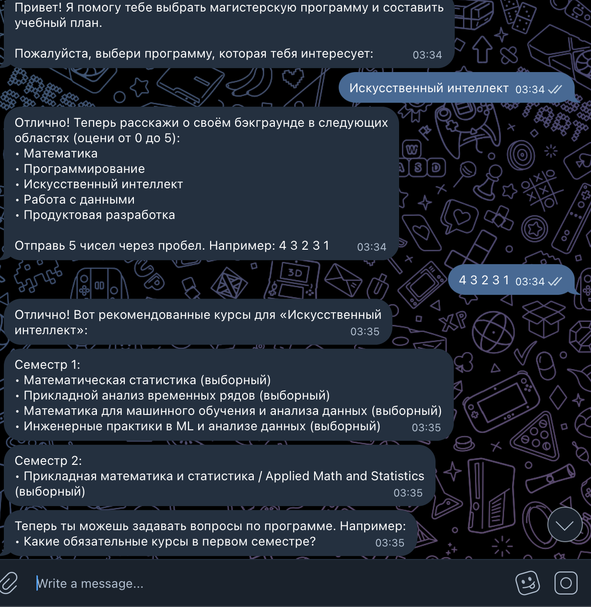

# Бот для поступления в ИТМО



Этот Telegram-бот помогает абитуриентам выбрать между двумя магистерскими программами по искусственному интеллекту в Университете ИТМО и спланировать обучение на основе их подготовки. 

В процессе разработки пользовался всем спектром AI-ассистентов и делал ставку на имплементацию готового концепта в сжатые сроки с интеграцией рекомендательной системы в каком то виде.

В основе бота лежит рекомендательная система, основанная на правилах и предназначенная для построения персонализированного учебного плана путем предложения релевантных курсов по выбору. Работа системы основана на скоринге каждого курса в зависимости от самооценки студента в ключевых областях, таких как программирование, наука о данных и математика. Для надежного сопоставления названий курсов с областями знаний алгоритм использует библиотеку pymorphy3 для проведения морфологического анализа (лемматизации), что позволяет точно определять разные формы слов. Система является гибкой и поддерживает две стратегии: deepen — для углубления знаний в уже сильных областях, и broaden — для расширения компетенций и заполнения пробелов. Все ключевые слова, определяющие области знаний, вынесены во внешний конфигурационный файл config.yaml, что обеспечивает простоту поддержки и расширения системы.

## Возможности
- Парсит данные учебных планов с сайтов ИТМО
- Рекомендует элективные курсы на основе подготовки студента
- Генерирует индивидуальные учебные планы
- Отвечает на вопросы о программах
- Поддерживает русский и английский языки

## Структура проекта
```
├── core/                  # Основная логика приложения
│   ├── domain/            # Доменные модели
│   └── services/          # Сервисы бизнес-логики
├── infrastructure/        # Инфраструктурные компоненты
│   ├── scraping/          # Функциональность веб-скрапинга
│   └── telegram/          # Реализация Telegram-бота
├── examples/              # Примеры данных учебных планов
├── src/                   # Дополнительные исходные файлы
├── knowledge_areas.yaml   # Конфигурация областей знаний
├── requirements.txt       # Зависимости Python
└── test_parser.py         # Скрипт тестирования парсера
```

## Установка
1. Создайте виртуальное окружение:
```bash
# Linux/macOS
python -m venv venv
source venv/bin/activate

# Windows
python -m venv venv
venv\Scripts\activate
```

2. Установите зависимости:
```bash
pip install -r requirements.txt
```

3. Настройте переменные окружения:
```bash
# Создайте файл .env с токеном вашего Telegram-бота
echo "TELEGRAM_BOT_TOKEN='your_bot_token_here'" > .env
```

4. Запустите бота:
```bash
python infrastructure/telegram/bot.py
```

## Конфигурация
Файл `knowledge_areas.yaml` определяет области знаний, используемые для рекомендаций. Пример структуры:
```yaml
knowledge_areas:
  math:
    - математика
    - алгебра
    - анализ
  programming:
    - программирование
    - алгоритм
    - python
```


## Использование
1. Запустите бота командой `/start`
2. Выберите программу (AI или AI Product)
3. Оцените свою подготовку по 5 областям (0-5 баллов)
4. Получите индивидуальный учебный план
5. Задавайте вопросы о программе

Пример взаимодействия:
```
User: /start
Bot: Добро пожаловать! Выберите программу: [AI, AI Product]
User: AI
Bot: Оцените вашу подготовку по математике (0-5): 
User: 4
...
```
